# Travel Wishlist with React, TypeScript, and Xano

In this tutorial, you will build a Travel Wishlist web application using the same general tools and development patterns you will encounter while contributing to Code-Sync Hub.

Our travel wishlist allows us to:

- View destinations stored in Xano
- Enter a city and country
- Validate the form
- Save a destination to Xano
- Automatically see the updated destination list

---

## 1. What Are We Building?

Our finished application will follow this architecture:

```text
┌───────────────────────────┐
│         FRONTEND          │
│                           │
│    React + TypeScript     │
│                           │
│    Travel Wishlist UI     │
└─────────────┬─────────────┘
              │
              │ HTTP Requests
              ▼
┌───────────────────────────┐
│            API            │
│                           │
│           Xano            │
│                           │
│ /destination-<your-name> │
└─────────────┬─────────────┘
              │
              │ Read / Write
              ▼
┌───────────────────────────┐
│         DATABASE          │
│                           │
│           Xano            │
│                           │
│ destination-<your-name>  │
└───────────────────────────┘
```


For this tutorial:

```text
Frontend
React + TypeScript

Backend: Database and API
Xano
```

---

## 2. Technology We Will Use in This Tutorial

| Tool | Purpose |
| --- | --- |
| VS Code | Writing code |
| React | Building the user interface |
| TypeScript | Adding type safety |
| Vite | Running and building the application |
| Tailwind CSS | Styling |
| shadcn/ui | Reusable UI components |
| React Router | Frontend routing |
| TanStack Query | Managing server data |
| React Hook Form | Managing forms |
| Zod | Form validation |
| Xano | Backend, API, and database |
| Git | Tracking code changes |
| GitHub | Sharing and reviewing code |

---

## 3. Install the Required Development Tools

### Install Node.js and npm

Our React application requires Node.js.

Node.js allows JavaScript and TypeScript development tools to run on your computer.

Installing Node.js also installs npm.

You do not need to install npm separately.

#### Step 1: Download Node.js

Go to:

```text
https://nodejs.org/
```

Download the current recommended LTS version of Node.js that meets the project requirement.

This project requires:

```text
Node.js 20.19 or newer
```

LTS stands for Long Term Support.

For this tutorial, use an LTS release rather than an experimental release.

#### Step 2: Run the Installer

Open the Node.js installer.

You can keep the default installation options.

Make sure npm is included in the installation.

Complete the installation.

#### Step 3: Restart VS Code

If VS Code was open while you installed Node.js, close VS Code completely and reopen it.

This allows VS Code's terminal to recognize the newly installed commands.

---

### Install Git

Git is the version control system we will use to track changes to our code.

Git allows us to:

- Clone repositories
- Create branches
- Track changes
- Create commits
- Push code to GitHub

#### Step 1: Download Git

Go to:

```text
https://git-scm.com/downloads
```

Select your operating system.

For Windows, download:

```text
Git for Windows
```

#### Step 2: Run the Installer

Open the Git installer.

For this tutorial, the default installation options should work.

Continue through the installer and complete the installation.

#### Step 3: Restart VS Code

If VS Code was open during the installation, close it completely and reopen it.

---

## 4. Verify Your Installations

Open VS Code.

Open:

```text
Terminal > New Terminal
```

Check that Node.js, npm, and Git are installed:

```bash
node --version
npm --version
git --version
```

Each command should return a version number.

Your development environment is ready.

---

## 5. Fork the Starter Repository

You will create your own copy using a GitHub fork.

```text
Girls Dream Code Repository
          │
          │ Fork
          ▼
Your GitHub Account
          │
          ▼
Your Copy
```

Open the Girls Dream Code onboarding repository.

Click:

```text
Fork
```

Select your GitHub account.

Keep the repository name:

```text
gdc-intern-onboarding-tutorial
```

Create the fork.

---

## 6. Clone Your Repository

Your fork currently exists on GitHub. Now you need a copy on your computer.

On your GitHub repository, click:

```text
Code
```

Select:

```text
HTTPS
```

Copy the repository URL. It should look similar to:

```text
https://github.com/YOUR-USERNAME/gdc-intern-onboarding-tutorial.git
```

Clone your repository:

```bash
git clone YOUR_REPOSITORY_URL
```

Then enter the project:

```bash
cd gdc-intern-onboarding-tutorial
```

---

## 7. Create a Feature Branch

We do not want to develop directly on the `main` branch.

Create a feature branch:

```bash
git switch -c feature/travel-wishlist
```

Verify your branch:

```bash
git branch
```

You should see:

```text
* feature/travel-wishlist
  main
```

The `*` shows your current branch.

---

## 8. Install the Project

The project's dependencies are listed in:

```text
package.json
```

Install them:

```bash
npm install
```

`npm` stands for Node Package Manager.

It reads `package.json` and downloads the packages required by the project.

You may notice a new folder:

```text
node_modules/
```

Do not manually edit this folder.

---

## 9. Run the Starter Application

Run:

```bash
npm run dev
```

Vite should display a localhost URL similar to:

```text
http://localhost:5173/
```

Open it in your browser.

Keep the terminal running.

Your computer is now serving the application locally.

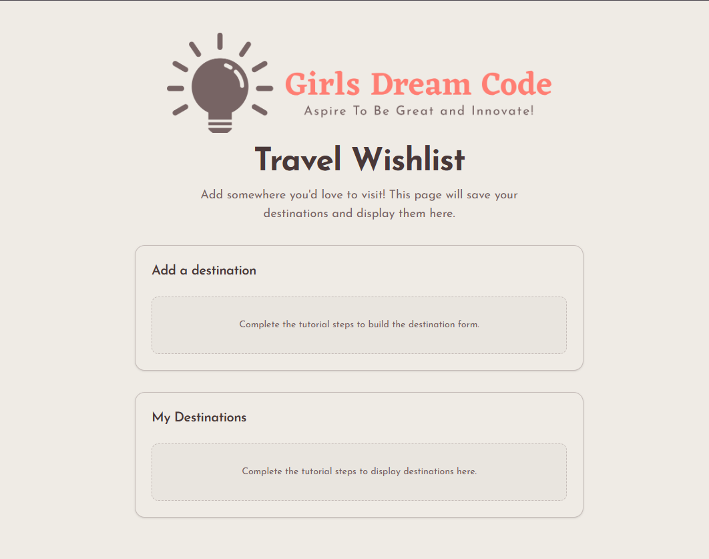

---

## 10. Explore the Project

The important files are organized approximately like this:

```text
src/
│
├── assets/
│
├── components/
│   ├── destination/
│   │   ├── form/
│   │   │   ├── DestinationForm.module.css
│   │   │   └── DestinationForm.tsx
│   │   └── list/
│   │       ├── DestinationList.module.css
│   │       └── DestinationList.tsx
│   └── ui/
│       └── card.tsx
│
├── lib/
│   ├── queryKeys.ts
│   └── utils.ts
│
├── pages/
│   ├── TravelWishlist.module.css
│   └── TravelWishlist.tsx
│
├── services/
│   └── destinationService.ts
│
├── types/
│   └── destination.ts
│
├── App.tsx
├── main.tsx
└── index.css
```

### `components/`

Reusable pieces of the user interface, grouped by feature. The destination form and list each keep their CSS Module beside the component.

### `pages/`

Larger application screens.

### `lib/`

Reusable application utilities and TanStack Query keys.

### `services/`

Functions that communicate with external services such as Xano.

### `types/`

TypeScript descriptions of our data.

### `assets/`

Images and other static files.

---

## 11. Understanding React Components

Open:

```text
src/components/destination/form/DestinationForm.tsx
```

You will see:

```tsx
export function DestinationForm() {
```

This creates a React component.

A component is a reusable piece of a user interface.

For example:

```tsx
function WelcomeMessage() {
  return <h1>Hello!</h1>;
}
```

Another component could display it with:

```tsx
<WelcomeMessage />
```

Now open:

```text
src/pages/TravelWishlist.tsx
```

You should see:

```tsx
<DestinationForm />
```

The component relationship is:

```text
TravelWishlist
      │
      ├── Header
      │
      ├── DestinationForm
      │
      └── Destination List
```

React applications are built by combining components.

---

## 12. Create the Xano Database Table

Open the Girls Dream Code Xano workspace.

Create a database table named:

```text
destination-<your-name>
```

Replace `<your-name>` with your name in lowercase, using hyphens instead of spaces. For example, Kayla would create `destination-kayla`. Each intern must use their own name so their work does not change another intern's data.

The table needs:

| Field | Type | Required |
| --- | --- | --- |
| `id` | Integer | Generated by Xano |
| `city` | Text | Yes |
| `country` | Text | Yes |

A database table can be thought of somewhat like a spreadsheet:

```text
destination-<your-name>

┌────┬───────────┬─────────────────┐
│ id │ city      │ country         │
├────┼───────────┼─────────────────┤
│ 1  │ Tokyo     │ Japan           │
│ 2  │ Chicago   │ United States   │
│ 3  │ Nairobi   │ Kenya           │
└────┴───────────┴─────────────────┘
```

Each row is a record.

Each column is a field.

---

## 13. Add Sample Data

Create at least three records:

```text
Tokyo     | Japan
Chicago   | United States
Nairobi   | Kenya
```

We are adding data manually so that we have something to retrieve when we build our GET request.

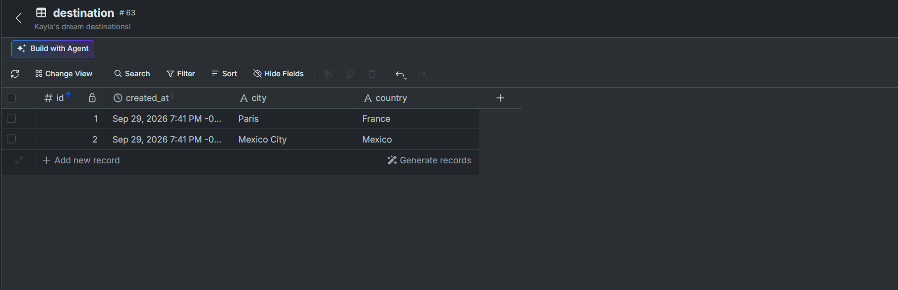

The screenshot shows the example table name `destination`. Your table will display your personalized name, such as `destination-kayla`.

---

## 14. Create and Test the GET Endpoint in Xano

Open the API section in Xano and create:

```text
GET /destination-<your-name>
```

Inside the endpoint's function stack, query all records from:

```text
destination-<your-name>
```

Save the endpoint.

Test it inside Xano.

You should receive something similar to:

```json
[
  {
    "id": 1,
    "city": "Tokyo",
    "country": "Japan"
  },
  {
    "id": 2,
    "city": "Chicago",
    "country": "United States"
  },
  {
    "id": 3,
    "city": "Nairobi",
    "country": "Kenya"
  }
]
```

If this works, your GET endpoint is ready.

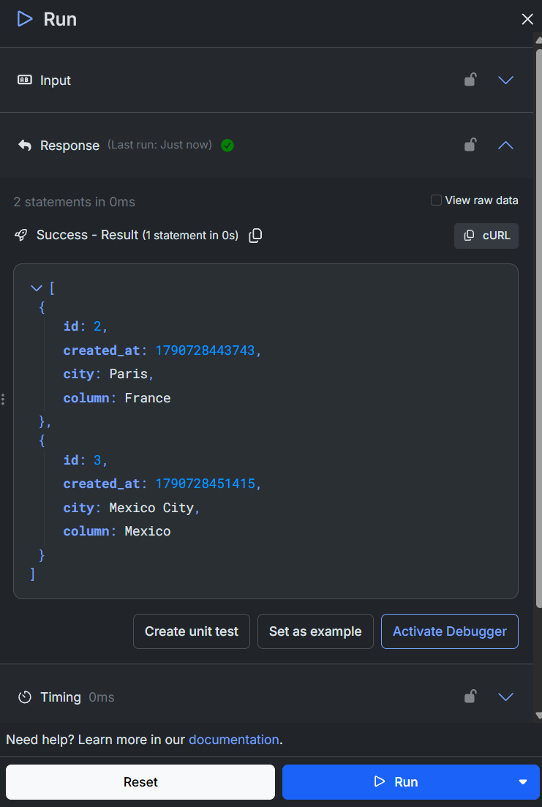

---

## 15. Understanding JSON

The response from Xano is JSON.

One destination looks like:

```json
{
  "id": 1,
  "city": "Tokyo",
  "country": "Japan"
}
```

This is an object.

Multiple objects inside square brackets form an array:

```json
[
  {},
  {},
  {}
]
```

Our endpoint therefore returns:

```text
An array of destination objects.
```

---

## 16. Understand the Destination Types

Open:

```text
src/types/destination.ts
```

### What Does This Code Do?

The first type says every complete destination contains:

```text
id       -> number
city     -> string
country  -> string
```

For example:

```ts
{
  id: 1,
  city: "Tokyo",
  country: "Japan"
}
```

`NewDestination` uses:

```ts
Omit<Destination, "id">
```

This means:

```text
Start with Destination
        │
        ▼
Remove id
        │
        ▼
NewDestination
```

A new destination only needs:

```text
city
country
```

Xano creates the ID.

---

## 17. Configure the Xano Environment Variable

Find:

```text
.env.example
```

Create a new file in the project root named:

```text
.env
```

Add:

```text
VITE_XANO_BASE_URL=YOUR_XANO_API_GROUP_URL
VITE_XANO_DESTINATION_PATH=/destination-your-name
```

For example:

```text
VITE_XANO_BASE_URL=https://example.xano.io/api:ABC123
VITE_XANO_DESTINATION_PATH=/destination-kayla
```

Do not include the destination path in `VITE_XANO_BASE_URL`.

`VITE_XANO_DESTINATION_PATH` must match the personalized GET and POST endpoint path you created in Xano. Keep the leading `/` and replace `your-name` with the same name you used for your table.

Do not place passwords, private API keys, authentication tokens, or other secrets in a `VITE_` environment variable.

Restart Vite after creating or changing `.env`:

```text
Ctrl + C
```

Then:

```bash
npm run dev
```

---

## 18. Build the Destination Service

Open:

```text
src/services/destinationService.ts
```

After the helper functions, add the following:

```ts
export async function getDestinations(): Promise<Destination[]> {
  const response = await fetch(getDestinationUrl());

  if (!response.ok) {
    throw new Error(await getErrorMessage(response));
  }

  return (await response.json()) as Destination[];
}

export async function addDestination(
  destination: NewDestination,
): Promise<Destination> {
  const response = await fetch(getDestinationUrl(), {
    method: "POST",
    headers: {
      "Content-Type": "application/json",
    },
    body: JSON.stringify(destination),
  });

  if (!response.ok) {
    throw new Error(await getErrorMessage(response));
  }

  return (await response.json()) as Destination;
}
```

Save the file.

---

## 19. Understand the API File

This line:

```ts
const XANO_BASE_URL = import.meta.env.VITE_XANO_BASE_URL;
```

retrieves the URL from `.env`.

This line:

```ts
const DESTINATION_PATH = import.meta.env.VITE_XANO_DESTINATION_PATH;
```

retrieves your personalized endpoint path from `.env`.

Together:

```text
https://example.xano.io/api:ABC123

+

/destination-kayla

=

https://example.xano.io/api:ABC123/destination-kayla
```

---

## 20. Understanding `async` and `await`

API requests take time.

The request travels:

```text
React
  │
  ▼
Internet
  │
  ▼
Xano
  │
  ▼
Internet
  │
  ▼
React
```

This is why our API functions use:

```text
async
await
```

For example:

```ts
const response = await fetch(getDestinationUrl());
```

means:

```text
Send the request and wait for the response before continuing.
```

---

## 21. Understanding `fetch()`

This:

```ts
fetch(getDestinationUrl())
```

sends an HTTP request.

If no method is specified, `fetch()` uses GET.

Therefore:

```ts
getDestinations()
```

eventually performs:

```text
GET /destination-<your-name>
```

The POST request explicitly includes:

```ts
method: "POST"
```

It also includes:

```ts
headers: {
  "Content-Type": "application/json",
}
```

This tells Xano that we are sending JSON.

The body:

```ts
body: JSON.stringify(destination)
```

converts our JavaScript object into JSON before sending it.

---

## 22. Understanding API Errors

The destination service checks:

```ts
if (!response.ok)
```

HTTP responses have status codes.

Examples:

```text
200 -> Successful request
404 -> Resource not found
500 -> Server error
```

If the request fails, our application throws an error.

The helper:

```ts
getErrorMessage()
```

attempts to retrieve a useful error message from Xano.

If Xano does not provide one, we use:

```text
Request failed with status ...
```

This will allow our UI to communicate failures to the user.

---

## 23. Understand the Query Key

Open:

```text
src/lib/queryKeys.ts
```

TanStack Query stores server data in a cache.

Think of it as temporary memory:

```text
TanStack Query Cache

"destinations"
     │
     ├── Tokyo
     ├── Chicago
     └── Nairobi
```

The query key gives that data a consistent name.

---

## 24. The UI Components

Our completed form uses reusable shadcn/ui components.

Inside:

```text
src/components/ui/
```

we need:

```text
button.tsx
input.tsx
label.tsx
```

These are reusable UI building blocks that we use instead of repeatedly building and styling these elements ourselves.

---

## 25. Build the Destination Form

Open:

```text
src/components/destination/form/DestinationForm.tsx
```

Starting on line 14, add the following:

```tsx
const destinationSchema = z.object({
  city: z.string().trim().min(1, "City is required."),
  country: z.string().trim().min(1, "Country is required."),
});

type DestinationFormValues = z.infer<typeof destinationSchema>;
```

On line 47, add the following:

```tsx
  function onSubmit(values: DestinationFormValues) {
    addDestinationMutation.mutate(values);
  }

```
On line 60, add the following:

```tsx
          onSubmit={handleSubmit(onSubmit)}
```
On line 75, add the following:

```tsx          
            {errors.city ? (
              <p
                id="city-error"
                className="text-sm font-medium text-red-700"
                role="alert"
              >
                {errors.city.message}
              </p>
            ) : null}
```
On line 99, add the following:

```tsx
            {errors.country ? (
              <p
                id="country-error"
                className="text-sm font-medium text-red-700"
                role="alert"
              >
                {errors.country.message}
              </p>
            ) : null}
```

Save the file.

---

## 26. Understanding Zod Validation

At the top of the file:

```ts
const destinationSchema = z.object({
  city: z.string().trim().min(1, "City is required."),
  country: z.string().trim().min(1, "Country is required."),
});
```

This defines our validation rules.

For city:

```ts
z.string()
```

means the value must be text.

```ts
.trim()
```

removes spaces from the beginning and end.

```ts
.min(1, "City is required.")
```

means at least one character must remain.

Therefore:

```text
"Tokyo"
   ↓
Valid

"    "
   ↓
trim()
   ↓
""
   ↓
Invalid
```

---

## 27. Understanding React Hook Form

This code:

```ts
const {
  register,
  handleSubmit,
  reset,
  formState: { errors },
} = useForm<DestinationFormValues>({
```

gives us several tools:

```text
register
    ↓
Connect inputs to the form

handleSubmit
    ↓
Process form submission

reset
    ↓
Clear the form

errors
    ↓
Validation errors
```

This:

```ts
resolver: zodResolver(destinationSchema)
```

connects React Hook Form to Zod.

The flow becomes:

```text
User Input
    │
    ▼
React Hook Form
    │
    ▼
Zod
   / \
Valid Invalid
  │      │
  ▼      ▼
Submit  Error
```

---

## 28. Understanding `register()`

Look at:

```tsx
{...register("city")}
```

This tells React Hook Form:

```text
This input represents the city field.
```

The country input uses:

```tsx
{...register("country")}
```

React Hook Form now knows which input belongs to which value.

---

## 29. Understanding Accessibility Attributes

The input also contains:

```tsx
aria-invalid={Boolean(errors.city)}
```

and:

```tsx
aria-describedby={errors.city ? "city-error" : undefined}
```

These attributes help assistive technologies understand whether the input has an error and which message describes it.

The error itself uses:

```tsx
role="alert"
```

Accessibility is part of building a good user interface, not an optional extra.

---

## 30. Understanding the Mutation

Earlier we discussed:

```text
Query
=
Read data

Mutation
=
Change data
```

Our form uses:

```ts
const addDestinationMutation = useMutation({
  mutationFn: addDestination,
```

This tells TanStack Query:

```text
When this mutation runs, call addDestination().
```

Then:

```ts
function onSubmit(values: DestinationFormValues) {
  addDestinationMutation.mutate(values);
}
```

means:

```text
Valid Form
    │
    ▼
onSubmit()
    │
    ▼
mutate(values)
    │
    ▼
addDestination(values)
    │
    ▼
POST /destination-<your-name>
```

---

## 31. Understanding Query Invalidation

After the POST succeeds:

```ts
onSuccess: async () => {
  reset();

  await queryClient.invalidateQueries({
    queryKey: destinationQueryKey,
  });
},
```

First:

```ts
reset();
```

clears the form.

Then:

```ts
invalidateQueries()
```

tells TanStack Query:

```text
The destination data you previously saved may now be outdated.
```

Visual:

```text
POST Rome
    │
    ▼
Xano saves Rome
    │
    ▼
POST succeeds
    │
    ▼
Invalidate "destinations"
    │
    ▼
GET destinations again
    │
    ▼
Updated data
```

---

## 32. Test Form Validation

Go to the browser.

Submit the form without entering anything.

You should see:

```text
City is required.

Country is required.
```

Try entering only spaces.

The form should still reject the values.

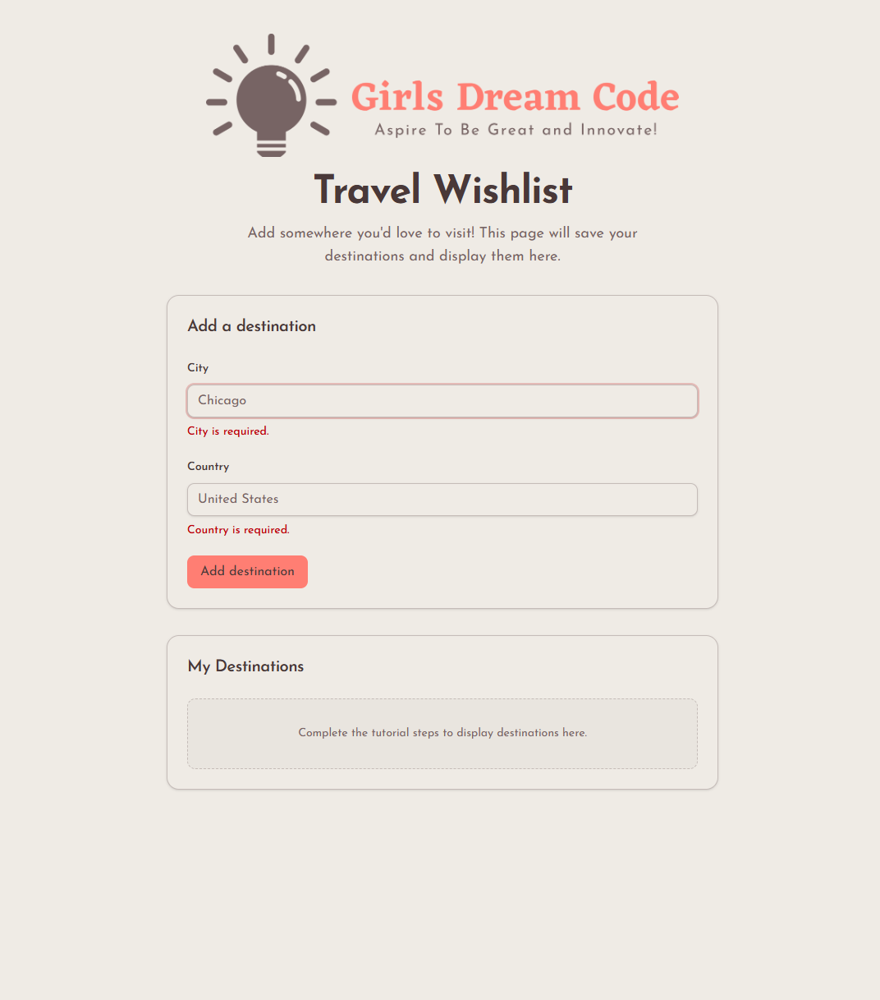

At this point the form validation works, but we still need to build the destination list.

---

## 33. Create `DestinationList.tsx`

Open:

```text
src/components/destination/list/DestinationList.tsx
```

On line 49, in the destination mapping, add the city and country:

```tsx
        <p className="font-semibold">{destination.city}</p>
        <p className="text-sm text-muted-foreground">{destination.country}</p>
```

Save the file.

You should see:

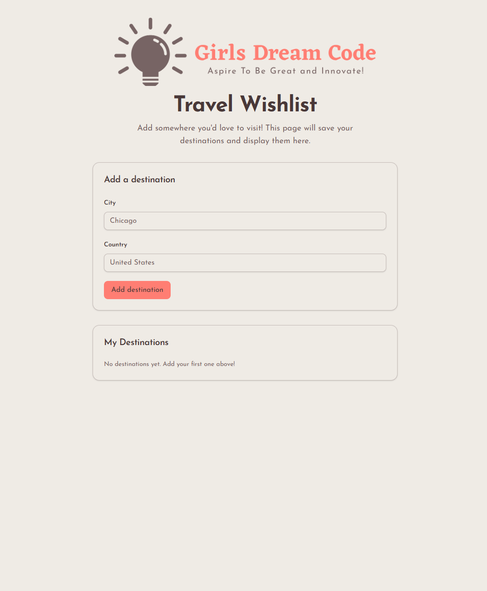
---

## 34. Understanding Props

Our `DestinationList` does not retrieve its own data.

Instead, another component gives it information.

These are called props.

Our component expects:

```ts
type DestinationListProps = {
  destinations: Destination[];
  error: Error | null;
  isLoading: boolean;
  isRefreshing: boolean;
  onRetry: () => void;
};
```

This can be visualized as:

```text
TravelWishlist
      │
      ├── destinations
      ├── error
      ├── isLoading
      ├── isRefreshing
      └── onRetry
             │
             ▼
      DestinationList
```

---

## 35. Understanding UI States

The destination list handles four major situations.

### Loading

```text
Loading destinations...
```

### Error

```text
Something went wrong.

[ Try again ]
```

### Empty

```text
No destinations yet.
Add your first one above!
```

### Success

```text
Tokyo
Japan

Chicago
United States
```

A successful request returning zero records is different from a failed request.

That is why empty and error are separate states.

---

## 36. Understanding `.map()`

When destinations exist, we use:

```tsx
destinations.map((destination) => (
```

`.map()` goes through every item in an array.

If our data is:

```text
Tokyo
Chicago
Nairobi
```

React creates:

```text
Tokyo
   ↓
List Item

Chicago
   ↓
List Item

Nairobi
   ↓
List Item
```

Inside each item:

```tsx
{destination.city}
```

displays the city.

```tsx
{destination.country}
```

displays the country.

---

## 37. Understanding React Keys

Each list item contains:

```tsx
key={destination.id}
```

React needs a reliable way to identify items in a list.

Our Xano ID provides that identifier.

```text
1 -> Tokyo
2 -> Chicago
3 -> Nairobi
```

---

## 38. Connect Everything in `TravelWishlist.tsx`

Open:

```text
src/pages/TravelWishlist.tsx
```

Find the placeholder card below `<DestinationForm />`:

```tsx
        {/* TODO: Replace this placeholder with the DestinationList component. */}
        <Card>
          {/* Placeholder content */}
        </Card>
```

Replace the entire placeholder card, including the TODO comment, with:

```tsx
        <DestinationList
          destinations={destinations}
          error={error}
          isLoading={isPending}
          isRefreshing={isFetching}
          onRetry={() => void refetch()}
        />
```

Because the placeholder card is gone, also remove this unused import:

```tsx
import { Card, CardContent, CardHeader, CardTitle } from "@/components/ui/card";
```

Save the file.

---

## 39. Understanding `useQuery()`

The most important part of the page is:

```ts
const {
  data: destinations = [],
  error,
  isPending,
  isFetching,
  refetch,
} = useQuery({
  queryKey: destinationQueryKey,
  queryFn: getDestinations,
});
```

`useQuery()` handles retrieving our server data.

The two most important options are:

```ts
queryKey: destinationQueryKey
```

and:

```ts
queryFn: getDestinations
```

The query key identifies the data.

The query function retrieves the data.

The flow is:

```text
useQuery()
   │
   ▼
getDestinations()
   │
   ▼
fetch()
   │
   ▼
GET /destination-<your-name>
   │
   ▼
Xano
   │
   ▼
Destination[]
```

---

## 40. Understanding Query Results

TanStack Query gives us several useful values.

### `destinations`

```ts
data: destinations = []
```

The API data.

We rename `data` to `destinations` because it is easier to understand.

### `error`

Contains the error if the request fails.

### `isPending`

Tells us whether the first request is still loading.

### `isFetching`

Tells us whether data is currently being retrieved.

This can also happen during a refresh.

### `refetch`

Allows us to manually request the data again.

---

## 41. Pass Data Using Props

This:

```tsx
<DestinationList
  destinations={destinations}
  error={error}
  isLoading={isPending}
  isRefreshing={isFetching}
  onRetry={() => void refetch()}
/>
```

passes the query information to `DestinationList`.

Visual:

```text
useQuery()
    │
    ▼
TravelWishlist
    │
    │ Props
    ▼
DestinationList
    │
    ▼
Browser
```

---

## 42. Test the GET Flow

Your browser should now display the destinations stored in Xano.

If Xano contains:

```text
Paris     France
```

those destinations should appear in the application.

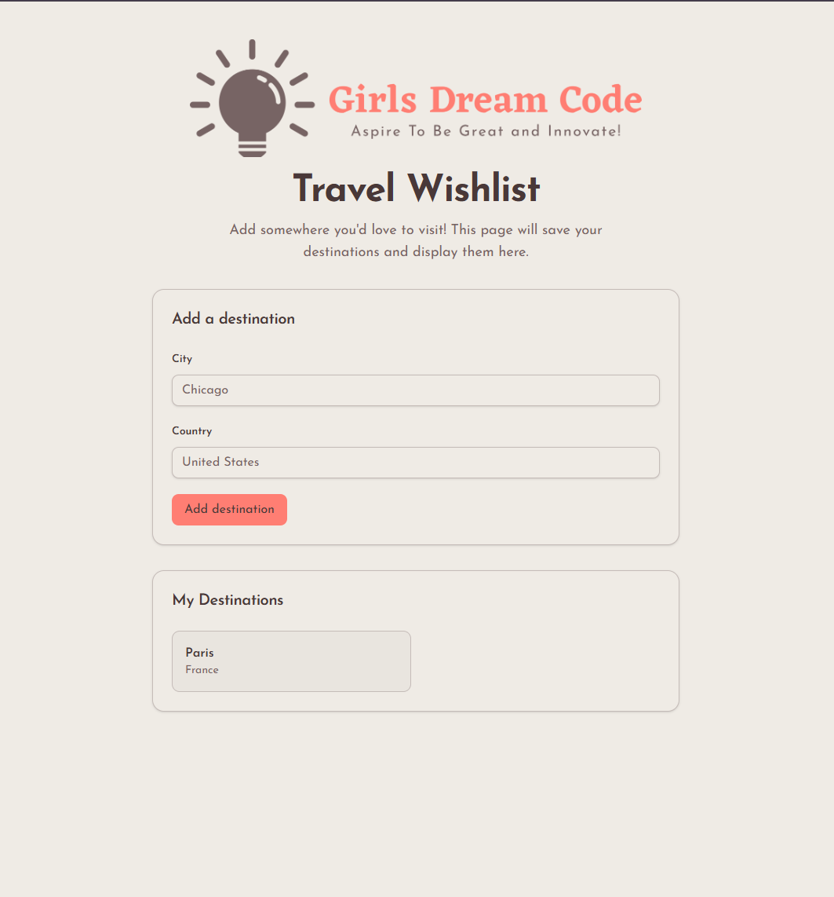

If they do not appear when you have data in your DB table, do not continue yet.

Check:

1. Does the GET endpoint work directly in Xano?
2. Are `VITE_XANO_BASE_URL` and `VITE_XANO_DESTINATION_PATH` correct?
3. Did you restart Vite after creating `.env`?
4. Does your endpoint match `VITE_XANO_DESTINATION_PATH` (for example, `/destination-kayla`)?
5. Does the browser console show an error?
6. Does the browser Network tab show the request?

If you do NOT have data in your table, you will see an empty destination list:

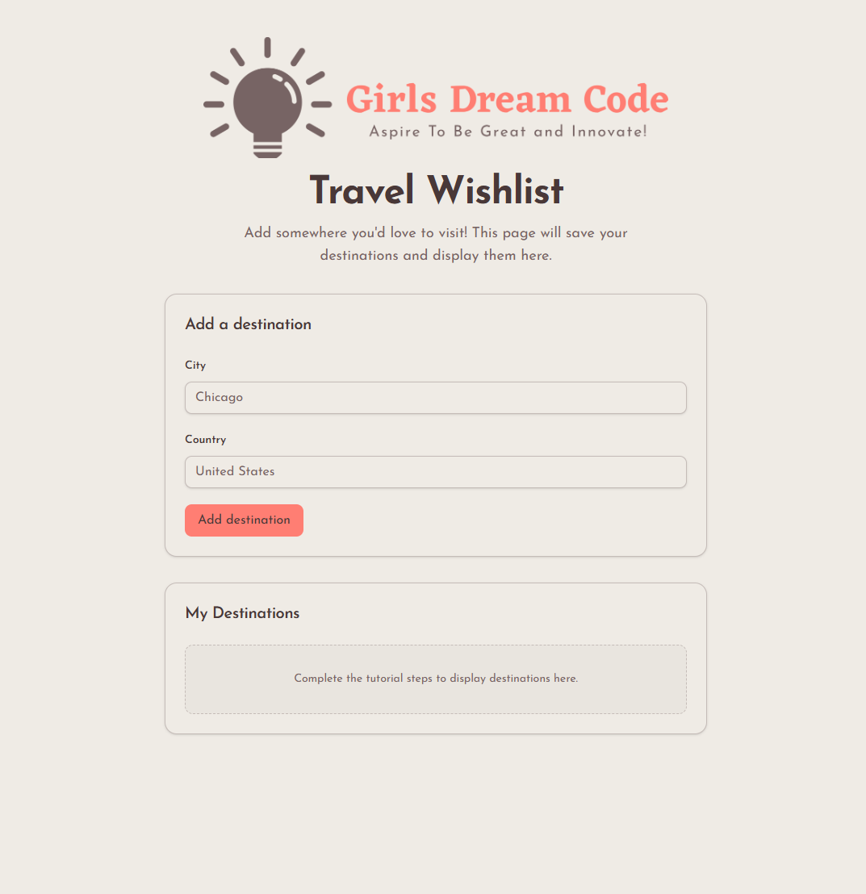
---

## 43. Create and Test the POST Endpoint in Xano

Return to the API section in Xano and create:

```text
POST /destination-<your-name>
```

Add two required text inputs:

```text
city
country
```

Inside the function stack, add a record to your `destination-<your-name>` table. Map the inputs as follows:

```text
Input city
    ↓
destination-<your-name>.city

Input country
    ↓
destination-<your-name>.country
```

Return the created destination record and save the endpoint.

Test it with:

```json
{
  "city": "Granada",
  "country": "Spain"
}
```
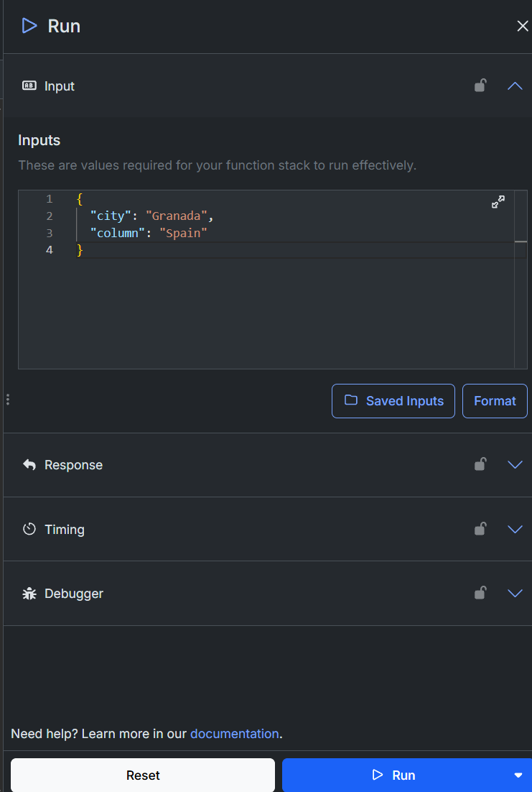

Run the endpoint.

Check the database.

You should see a new record for:

```text
Granada
Spain
```

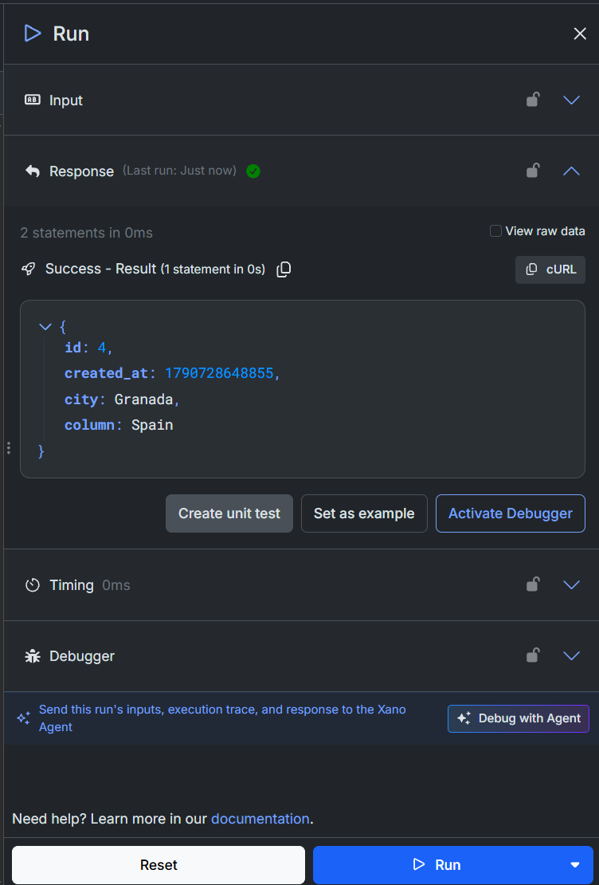

Do not test the React form until the POST endpoint works directly in Xano.

---

## 44. Test the Complete Form

Return to your React application.

Enter:

```text
City:
Seoul

Country:
South Korea
```

Click:

```text
Add destination
```

Several things should happen:

```text
User clicks Add destination
        │
        ▼
React Hook Form
        │
        ▼
Zod Validation
        │
        ▼
useMutation()
        │
        ▼
addDestination()
        │
        ▼
POST /destination-<your-name>
        │
        ▼
Xano
        │
        ▼
Database Record Created
        │
        ▼
Mutation Success
        │
        ├── reset()
        │
        └── invalidateQueries()
                 │
                 ▼
         GET /destination-<your-name>
                 │
                 ▼
           Updated List
```

Expected results:

- Seoul is saved in Xano
- The form clears
- The destination list refreshes
- Seoul appears without manually refreshing the page

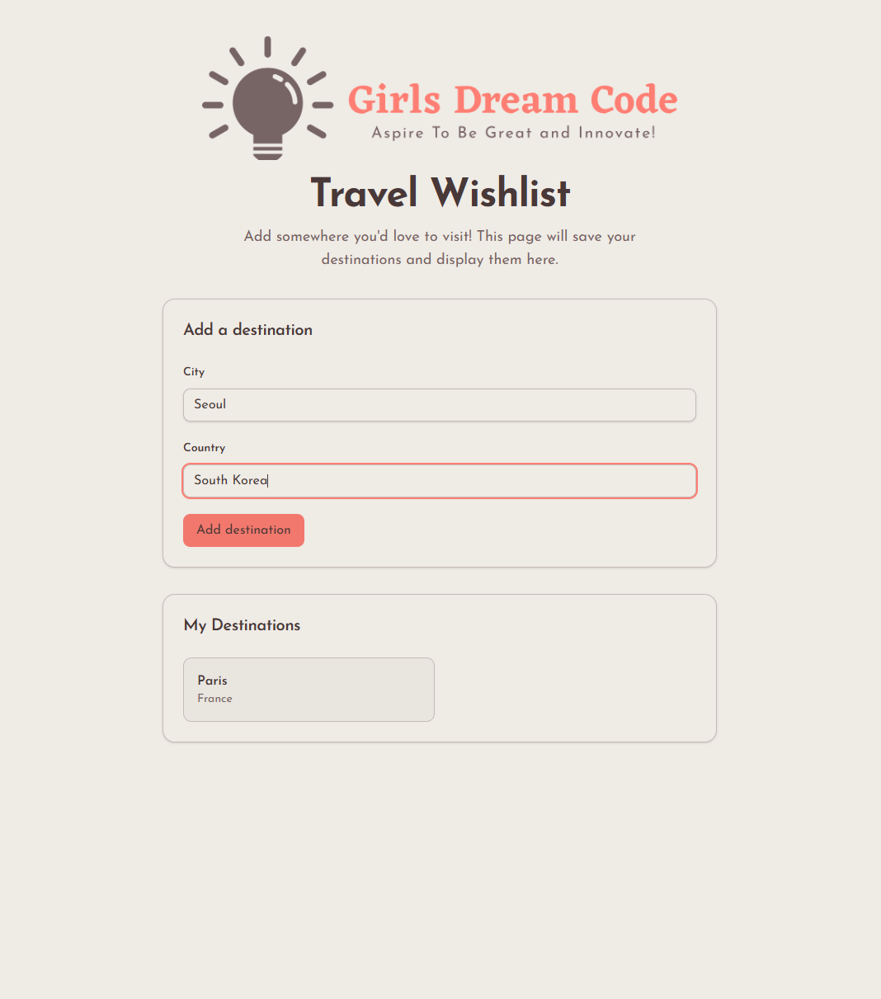
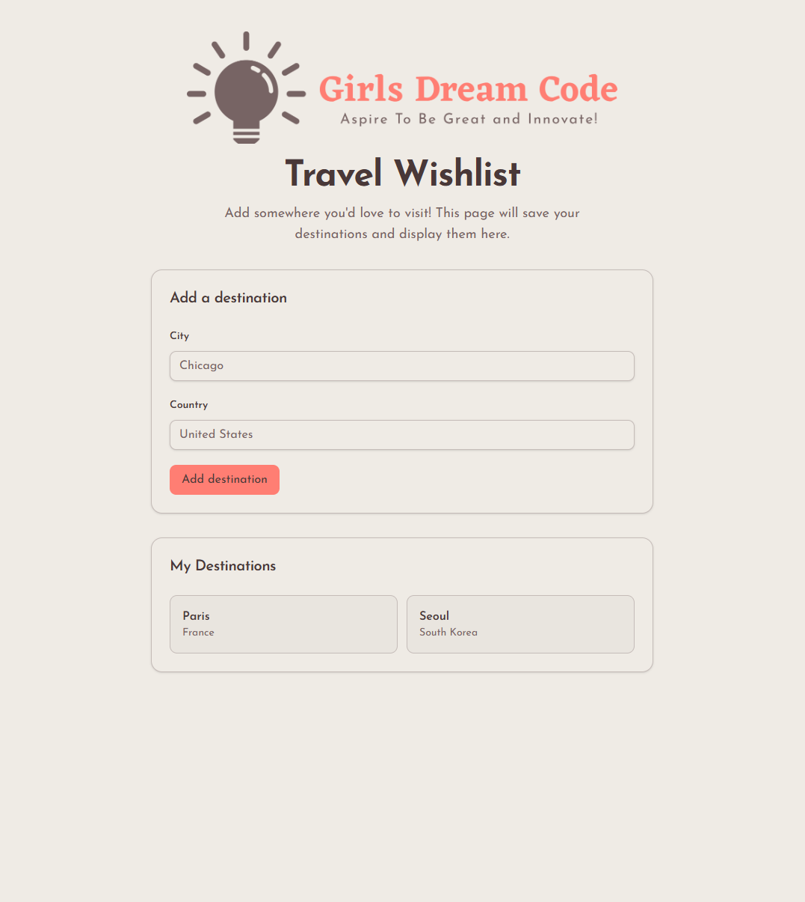

---

## 45. Understand the Complete Application

You have now built the core feature.

The architecture is:

```text
USER
 │
 ▼
REACT
 │
 ├── DestinationForm
 │
 └── DestinationList
 │
 ▼
TANSTACK QUERY
 │
 ├── useQuery
 │
 └── useMutation
 │
 ▼
API.TS
 │
 ├── getDestinations()
 │
 └── addDestination()
 │
 ▼
HTTP
 │
 ├── GET /destination-<your-name>
 │
 └── POST /destination-<your-name>
 │
 ▼
XANO
 │
 ▼
DATABASE
```

---

## 46. Understand the File Responsibilities

Your project now includes:

```text
src/
│
├── components/
│   ├── destination/
│   │   ├── form/
│   │   │   ├── DestinationForm.module.css
│   │   │   └── DestinationForm.tsx
│   │   │           ├── Form
│   │   │           ├── Validation
│   │   │           └── POST Mutation
│   │   └── list/
│   │       ├── DestinationList.module.css
│   │       └── DestinationList.tsx
│   │               └── Display Destinations
│   │
│   └── ui/
│           │
│           ├── button.tsx
│           ├── card.tsx
│           ├── input.tsx
│           └── label.tsx
│
├── lib/
│   │
│   └── queryKeys.ts
│           │
│           └── Query Identifiers
│
├── services/
│   └── destinationService.ts
│           │
│           └── Xano Communication
│
├── pages/
│   │
│   └── TravelWishlist.tsx
│           │
│           ├── GET Query
│           └── Connect Components
│
└── types/
    │
    └── destination.ts
            │
            └── Data Types
```

Separating responsibilities makes larger applications easier to understand and maintain.

---

## 47. Understand the Component Tree

Our React components form a tree:

```text
main.tsx
   │
   ▼
App.tsx
   │
   ▼
TravelWishlist
   │
   ├───────────────┐
   ▼               ▼
DestinationForm  DestinationList
```

`TravelWishlist` is the parent of:

```text
DestinationForm
DestinationList
```

---

## 48. Understand `main.tsx`

Open:

```text
src/main.tsx
```

The starter project should already contain the application providers.

It should look similar to:

```tsx
import { StrictMode } from "react";
import { createRoot } from "react-dom/client";
import { QueryClient, QueryClientProvider } from "@tanstack/react-query";
import { BrowserRouter } from "react-router-dom";

import App from "@/App";
import "@/index.css";

const queryClient = new QueryClient();

createRoot(document.getElementById("root")!).render(
  <StrictMode>
    <QueryClientProvider client={queryClient}>
      <BrowserRouter>
        <App />
      </BrowserRouter>
    </QueryClientProvider>
  </StrictMode>,
);
```

You should not need to change this file.

---

## 49. Understanding `QueryClientProvider`

Our application is wrapped with:

```tsx
<QueryClientProvider client={queryClient}>
```

Think of it as providing TanStack Query functionality to everything inside it.

```text
QueryClientProvider
┌────────────────────────────┐
│                            │
│ BrowserRouter              │
│ ┌────────────────────────┐ │
│ │                        │ │
│ │ App                    │ │
│ │                        │ │
│ │ TravelWishlist         │ │
│ │                        │ │
│ │ DestinationForm        │ │
│ │ DestinationList        │ │
│ │                        │ │
│ └────────────────────────┘ │
│                            │
└────────────────────────────┘
```

This is why our components can use:

```text
useQuery()
useMutation()
useQueryClient()
```

---

## 50. Understanding `BrowserRouter`

The application is also wrapped with:

```tsx
<BrowserRouter>
```

React Router allows React applications to support multiple frontend pages and URLs.

This tutorial only needs one main screen, but larger applications may eventually have routes such as:

```text
/dashboard
/reports
/settings
```

---

## 51. Test Loading, Error, Empty, and Success States

A good application should work in more situations than the ideal case.

Test the following.

### Test 1: Successful GET

Refresh the page.

Expected:

```text
Destinations load.
```

### Test 2: Empty Form

Submit without entering anything.

Expected:

```text
City is required.
Country is required.
```

### Test 3: Spaces Only

Enter spaces into both fields.

Expected:

```text
Validation fails.
```

### Test 4: Successful POST

Add a destination.

Expected:

```text
Database record created.
Form clears.
Destination appears.
```

### Test 5: Browser Refresh

Refresh the entire browser.

The destination should remain.

This demonstrates an important concept.

The destination is stored in Xano, not only in React.


### Test 6: Mobile Width

Open your browser's Developer Tools.

Switch to a mobile or narrow screen.

Check that:

- Text is readable
- Inputs fit
- Buttons are usable
- Destination cards fit
- Nothing requires horizontal scrolling

---

## 52. Learn Basic Debugging

Something will eventually break while developing software.

That is normal.

Debugging means determining:

```text
What happened?

Where did it happen?

Why did it happen?

How can we fix it?
```

Do not randomly change code.

Start with evidence.

A useful debugging order is:

1. Read the error message.
2. Check VS Code for TypeScript errors.
3. Check the terminal.
4. Check the browser Console.
5. Check the browser Network tab.
6. Test the Xano endpoint directly.
7. Compare the frontend data shape with the Xano response.
8. Check environment variables.

---

## 53. Use the Browser Network Tab

Open your browser Developer Tools.

Select:

```text
Network
```

Refresh the application.

Find the request to:

```text
destination-<your-name>
```

Click the request.

You can inspect:

```text
Request URL
Request Method
Status Code
Request Payload
Response
```

For a successful POST, you might see:

```text
Request Method:
POST

Status:
200

Payload:
{
  city: "Rome",
  country: "Italy"
}
```

This is extremely useful when debugging frontend and backend communication.

---

## 54. Debug From Both Directions

If destinations are not displaying:

```text
Does GET work directly in Xano?
          │
     ┌────┴────┐
     │         │
    NO        YES
     │         │
     ▼         ▼
Backend     Check Browser
Problem     Network Tab
                │
          Is request sent?
             /       \
           NO         YES
           │           │
           ▼           ▼
       Frontend     Check Response
       Problem
```

Do not assume every problem is a React problem.

Do not assume every problem is a Xano problem.

Determine where the data stops moving correctly.

---

## 55. Using AI Coding Tools Responsibly

During Girls Dream Code projects, you may use AI coding tools such as GitHub Copilot.

AI can help with:

- Explaining code
- Suggesting implementations
- Debugging errors
- Generating repetitive code
- Reviewing code

AI generated code still becomes your team's code.

Do not assume:

```text
AI wrote it
=
It must be correct
```

Instead:

```text
AI Suggestion
     │
     ▼
Read It
     │
     ▼
Understand It
     │
     ▼
Test It
     │
     ▼
Review Git Diff
     │
     ▼
Commit
```

If AI produces code you do not understand, ask it to explain the code before using it.

---

## 56. Protect Sensitive Information

Do not paste sensitive or confidential information into AI tools or commit it to GitHub.

Examples include:

- Passwords
- Private API keys
- Authentication tokens
- Participant information
- Private donor information
- Sensitive organization information

Your `.env` file should not be committed.

Before committing, always check:

```bash
git status
```

Make sure `.env` is not listed as a file that will be committed.

---

## 57. Run the Project Checks

Before committing your work, run:

```bash
npm run typecheck
npm run build
```

Both commands should finish without errors.

---

## 58. Review Your Git Changes

Run:

```bash
git status
```

This shows which files changed.

You may see something similar to:

```text
modified:
  src/components/destination/form/DestinationForm.tsx

modified:
  src/services/destinationService.ts

modified:
  src/pages/TravelWishlist.tsx

new file:
  src/components/destination/list/DestinationList.tsx

new file:
  src/lib/queryKeys.ts
```

Now run:

```bash
git diff
```

This shows the actual code changes.

Always review your changes before committing them.

---

## 59. Stage Your Changes

Run:

```bash
git add .
```

This moves your changes into Git's staging area.

```text
Working Files
     │
     │ git add .
     ▼
Staging Area
```

The staging area contains the changes you intend to include in your next commit.

---

## 60. Commit Your Changes

Run:

```bash
git commit -m "Build Travel Wishlist Xano flow"
```

A commit is a saved checkpoint in your Git history.

```text
Project History

● Starter Template
        │
        ▼
● Build Travel Wishlist Xano Flow
```

---

## 61. Push Your Branch

Run:

```bash
git push -u origin feature/travel-wishlist
```

Your branch now exists on GitHub.

```text
Your Computer
     │
     │ git push
     ▼
GitHub
```

Refresh your repository on GitHub.

You should see your branch.

---

## 62. Create a Pull Request

A Pull Request asks someone to review your branch before its changes are merged into `main`.

```text
feature/travel-wishlist
          │
          ▼
     Pull Request
          │
          ▼
        Review
          │
          ▼
         main
```

On GitHub, click:

```text
Compare & pull request
```

Use a title similar to:

```text
Build Travel Wishlist Xano Integration
```

For the description, you can use:

```md
## Summary

- Connected the Travel Wishlist frontend to Xano
- Added destination GET request
- Added destination POST request
- Added form validation
- Added loading, error, empty, and success states
- Added automatic destination refresh after submission

## Testing

- Tested empty form validation
- Tested successful destination creation
- Tested page refresh
- Tested loading and error states
- Tested mobile layout
- Ran typecheck
- Ran production build
```

---

## 63. Understand Code Review

Another team member may leave comments on your Pull Request.

Code review is a normal part of software development.

It helps teams:

- Catch mistakes
- Share knowledge
- Maintain standards
- Improve code
- Prevent bugs

If someone requests a change:

1. Make the change locally.
2. Test it.
3. Commit the change.
4. Push the branch again.

You do not need to create another PR.

Your existing PR will update automatically.

---

## 64. Complete Application Data Flow

When the page loads:

```text
Browser Opens
      │
      ▼
TravelWishlist
      │
      ▼
useQuery()
      │
      ▼
getDestinations()
      │
      ▼
fetch()
      │
      ▼
GET /destination-<your-name>
      │
      ▼
Xano API
      │
      ▼
destination-<your-name> Table
      │
      ▼
JSON Response
      │
      ▼
TanStack Query
      │
      ▼
TravelWishlist
      │
      │ Props
      ▼
DestinationList
      │
      ▼
Browser
```

When the user creates a destination:

```text
User
 │
 ▼
DestinationForm
 │
 ▼
React Hook Form
 │
 ▼
Zod
 │
 ├──────── Invalid
 │             │
 │             ▼
 │        Error Message
 │
 ▼ Valid
useMutation()
 │
 ▼
addDestination()
 │
 ▼
POST /destination-<your-name>
 │
 ▼
Xano
 │
 ▼
Database
 │
 ▼
Record Created
 │
 ▼
onSuccess()
 │
 ├── reset()
 │
 └── invalidateQueries()
            │
            ▼
      GET /destination-<your-name>
            │
            ▼
       Updated Data
            │
            ▼
      DestinationList
            │
            ▼
           User
```

---

## 65. How This Pattern Applies to Larger Applications

The Travel Wishlist is intentionally simple.

The same architecture can be reused for larger applications.

Today:

```text
GET /destination-<your-name>

POST /destination-<your-name>
```

Another application might use:

```text
GET /records

POST /records

GET /reports

POST /reports
```

The names and data change.

The basic pattern stays similar.

```text
USER
  │
  ▼
REACT
  │
  ▼
TANSTACK QUERY
  │
  ▼
API FUNCTION
  │
  ▼
HTTP REQUEST
  │
  ▼
XANO
  │
  ▼
DATABASE
```

That pattern is one of the most important things to understand from this tutorial.

---

## 66. Final Challenge

Without looking at the previous diagrams, explain what happens when a user enters:

```text
Barcelona
Spain
```

Try to use these words:

- React
- Form
- Zod
- Mutation
- POST
- API
- Xano
- Database
- Query
- GET
- Props
- Component

A strong explanation might be:

> The user enters Barcelona and Spain into the React form. React Hook Form collects the values and Zod validates them. If the values are valid, the mutation calls the `addDestination` function. That function sends a POST request to the Xano API. Xano creates the destination in the database. After the POST succeeds, TanStack Query invalidates the destinations query. The application sends another GET request to Xano and receives the updated destination list. TravelWishlist passes the destinations to the DestinationList component using props, and React displays Barcelona, Spain on the page.

If you understand this process, you understand the main goal of this tutorial.

---

## 67. Final Testing Checklist

Before submitting your Pull Request, confirm:

- [ ] `npm install` completed successfully
- [ ] The project starts with `npm run dev`
- [ ] The Travel Wishlist page loads
- [ ] `.env` contains the correct Xano base URL and personalized destination path
- [ ] GET `/destination-<your-name>` works directly in Xano
- [ ] Existing Xano destinations appear in React
- [ ] Loading state works
- [ ] Empty state works
- [ ] GET error state works
- [ ] City is required
- [ ] Country is required
- [ ] Spaces-only values fail validation
- [ ] POST `/destination-<your-name>` works directly in Xano
- [ ] A destination can be submitted from React
- [ ] POST creates exactly one database record
- [ ] The form clears after success
- [ ] The destination list automatically refreshes
- [ ] Data remains after refreshing the browser
- [ ] POST errors are communicated to the user
- [ ] The page works at mobile width
- [ ] `.env` is not being committed
- [ ] No passwords or private credentials are in the repository
- [ ] `npm run typecheck` passes
- [ ] `npm run build` passes
- [ ] `git diff` was reviewed
- [ ] Changes were committed on `feature/travel-wishlist`
- [ ] The branch was pushed to GitHub
- [ ] A Pull Request was created

---

## 68. Troubleshooting

### `npm` is not recognized

Run:

```bash
node --version
npm --version
```

If these commands are not recognized, Node.js may not be installed correctly.

### The application will not open

Make sure:

```bash
npm run dev
```

is still running.

Look for the localhost URL in the terminal.

### Xano data does not appear

Check:

1. Does GET work directly in Xano?
2. Are `VITE_XANO_BASE_URL` and `VITE_XANO_DESTINATION_PATH` correct?
3. Did you restart Vite?
4. Does the endpoint match `VITE_XANO_DESTINATION_PATH`?
5. Check the browser Network tab.
6. Check the browser Console.

### POST does not create a destination

Check:

1. Does POST work directly in Xano?
2. Are the inputs named `city` and `country`?
3. Is the method `POST`?
4. Is the request body JSON?
5. Does the Network tab show the request?
6. Does Xano return an error?

### Destination saves but does not appear

Check:

```ts
await queryClient.invalidateQueries({
  queryKey: destinationQueryKey,
});
```

Your GET query and mutation invalidation must use the same query key.

### TypeScript shows an error

Hover over the red underline.

Read the error.

TypeScript often tells you:

```text
Expected one type
but received another type
```

Do not remove TypeScript simply to make the error disappear.

Determine why the values do not match.

---
